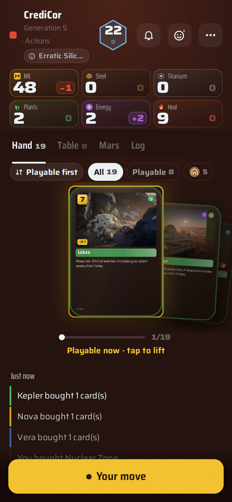
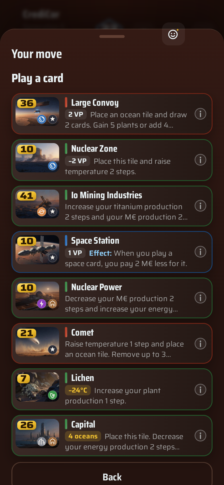
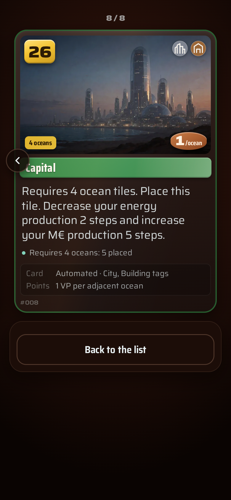
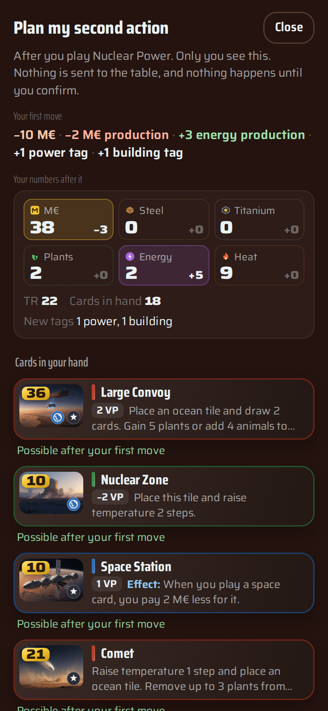
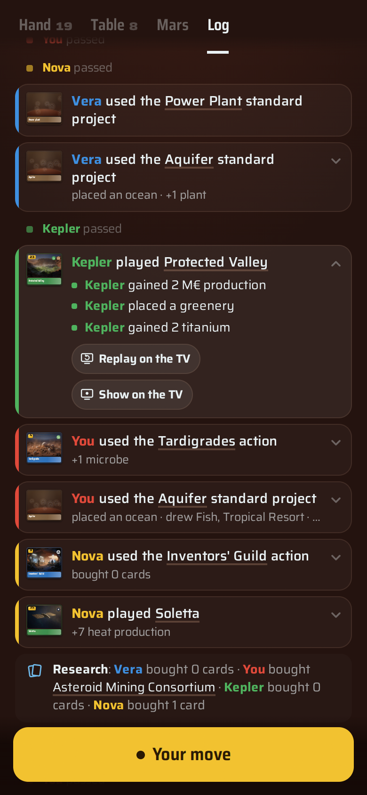
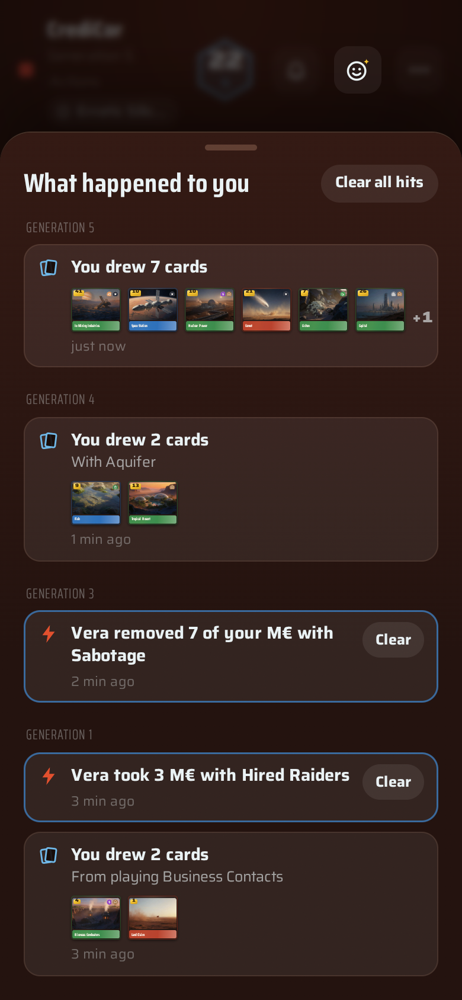

# Mars Ledger

A table companion for the Terraforming Mars board game. Each player keeps their player board on their phone:
resources, production, cards, tags and blue-card actions. On the TV you see an animated Mars, the players, the
milestones and awards, and short moments when something big happens.

You run it on your own network with Docker, without accounts or the cloud.


<table>
  <tr>
    <td></td>
    <td></td>
    <td></td>
  </tr>
  <tr>
    <td></td>
    <td></td>
    <td></td>
  </tr>
</table>

> Mars Ledger is an unofficial fan-made companion for the Terraforming Mars board game. It is not affiliated with
> or endorsed by FryxGames, Stronghold Games or Asmodee. Terraforming Mars is a trademark of FryxGames. You need a
> copy of the board game to play.

Documentation: <https://murtaza-nasir.github.io/mars-ledger/>

## Features

- **Two ways to play.** In a companion game you play on the physical board and keep the books on the phones. In a
  full game the board is on the TV, the cards are on the phones, and every rule is applied by the open-source
  [Terraforming Mars engine](https://github.com/terraforming-mars/terraforming-mars).
- **Phones.** Your hand, your table, the map and a readable log. Each decision is a sheet with only
  the legal choices. Profiles hold your games, wins and achievements across game nights.
- **Cards you can read at a glance.** Every card list shows what each card does in two lines, with its
  requirement and points as chips. Hold up a card to see hints with counts from the current game: "You
  have 3 space tags, 4 with this card", "Oxygen 5% max: now 3%".
- **Turn planning.** See what a move will do before you confirm it. Plan your second action from the first
  move's sheet; when you come back, the plan is checked against the real game in the turn menu. Between turns, pin
  the cards you intend to play and see them totalled against next generation's income. Plans stay on your phone.
- **The TV.** A 3D board with modelled cities, forests and oceans, weather, and day and night, or a
  flat board on screens too slow for 3D. Each played card gets a moment: the player's chime, the card held for
  reading, then its effects one at a time. The pace is faster when moves pile up. The production phase,
  milestone races and an end-of-game podium are shown too.
- **Phone and TV together.** Replay any move on the TV, or make the spaces it changed glow, from the log. When
  someone hits you, you feel it on an Android phone as the TV shows it.
- **Bots.** Fill empty seats in full games with Easy and Normal bots to play solo or with a short table. A
  Hard level (Jev) is available with an API key.
- **Notices.** When another player takes your plants or lowers your production, you see it on your phone, with
  the card behind it.
- **Undo.** Take back your own move while nobody else has moved, including after bot moves.
- **Maps and Prelude.** Tharsis, Hellas and Elysium, or a random draw. Prelude, the draft, fast mode and a turn
  clock are table-wide switches.
- **The poster.** At the end of each game, a poster of the finished planet with every player's result, to save
  on the phones.
- **Optional extras**, each off until you set it up:
  - photo scanning of cards in companion games, with a local vision model or OpenRouter;
  - mission control: short commentary on the TV, as text or spoken (Gemini through OpenRouter recommended);
  - a radio on the TV for a YouTube playlist of your choice;
  - a one-off painting for the poster from a Stable Diffusion Forge server.

## Requirements

- A computer or small server with Docker and the Compose plugin. It stays on during the game.
- A TV or big screen with a web browser. The 3D board needs WebGL2; any GPU from the last few years is enough.
  Slower screens get the flat board automatically. A laptop or streaming stick on the TV's HDMI input is
  often faster than a built-in TV browser.
- One iPhone or Android phone per player, on the same network. No app is needed.
- A copy of the board game.

## Quick start

```sh
git clone https://github.com/murtaza-nasir/mars-ledger.git
cd mars-ledger/deploy
cp ../.env.example .env   # optional: every setting has a default
```

Start it with the published images:

```sh
docker compose up -d
```

Or build both images on this machine. You need access to github.com. The first engine build takes several
minutes:

```sh
docker compose -f docker-compose.yml -f docker-compose.build.yml up -d --build
```

Then:

1. Open `http://<your-server>:8080/tv` on the TV.
2. Each player scans the QR code with their phone and takes a seat.
3. On any phone, choose the mode and the map, and start.

To use another port, set `MARS_LEDGER_PORT` in `deploy/.env`. If the server's address differs between the
phones and the TV, set `PUBLIC_URL`.


## How a game night works

1. Start Mars Ledger and open `/tv` on the TV. You see the lobby with a QR code.
2. Everyone scans it and picks their profile, or makes one.
3. On any phone, choose **Full game** or **Companion**, the map, Prelude, the draft and fast mode. Add bots if
   seats are empty (full games).
4. Start. Each player picks a corporation on their phone, and the corporations are revealed on the TV.
5. Play. You take your turn on your phone. You see the board, the standings and the big moments on the TV.
   Attacks and other effects on you are shown as notices on your phone.
6. At the end, the podium, everyone's new achievements and the poster are shown on the TV. Each player gets the
   poster on their phone to save.
7. Tap **Start a new game** in the game menu for the next round.

## Configuration

All settings are environment variables in `deploy/.env`. Each one is optional and documented in
`.env.example`. The main groups:

| Group | Variables | Without them |
|---|---|---|
| Core | `PUBLIC_URL`, `MARS_LEDGER_PORT`, `DATA_DIR` | the address opened on the TV, port 8080 |
| Engine | `ENGINE_URL`, `FULL_GAME` | set by the compose file; full games on |
| Photo scanning | `LOCAL_VLM_URL` + `LOCAL_VLM_MODEL`, or `OPENROUTER_API_KEY` | no Photo button; number and name search only |
| Mission control | `NARRATOR_LLM_URL` + `NARRATOR_LLM_MODEL` (or the `LOCAL_VLM_*` pair) | hidden |
| Mission control voice | `NARRATOR_TTS_URL`, or `NARRATOR_TTS_PROVIDER=gemini` + `OPENROUTER_API_KEY` | only Off and Text |
| Radio | `RADIO_PLAYLIST` | no radio |
| Poster painting | `POSTER_FORGE_URL` | built-in paintings only |
| Hard (Jev) bots | `TYPESAFE_API_KEY` | Easy and Normal only |
| Source link | `SOURCE_URL` | this project's repository |

See the [configuration reference](site/docs/configuration.md) for every variable and default. For outside
monitors, use `GET /api/health` (see [Troubleshooting](site/docs/troubleshooting.md#health-check)).

### HTTPS

Every feature is available over plain HTTP on your network. With HTTPS, you can save the poster through the phone's
share sheet and use photo scanning on phones where the camera is blocked on plain HTTP.
`deploy/Caddyfile.example` is a ready Caddy configuration; Nginx Proxy Manager and `tailscale serve` are
alternatives. See
[Installation](site/docs/installation.md#https).

## Optional AI features

- **Photo scanning.** In a companion game, photograph a card instead of typing its number. Use any
  OpenAI-compatible server with a vision model (vLLM, llama.cpp, Ollama, LM Studio) or OpenRouter.
- **Mission control.** Short lines about attacks, big plays, milestones and lead changes on the TV. You need an
  OpenAI-compatible chat model. For voice, use Gemini 3.8 Flash TTS through OpenRouter (recommended,
  `NARRATOR_TTS_PROVIDER=gemini`), or an OpenAI-compatible speech server. The table turns it on in the lobby; it
  is off by default. You can check on it in the TV options and at `/api/health`.

See [Optional AI features](site/docs/optional-ai.md).

## Bot levels

Bots are for full games only. Add them in the lobby with a name, a colour and a level.

| Level | How it plays |
|---|---|
| Easy | Plays loosely: random cards, random tiles, passes early. |
| Normal | Plays sensibly: buys and plays the cards that pay off, claims milestones, funds awards it leads, and keeps standard projects for the endgame. |
| Hard (Jev) | Normal's top moves, chosen by TypeSafe's Jev model. Offered only with `TYPESAFE_API_KEY`; spend per game is capped. |

Bot speed (Quick, Table pace, Slow) is a table setting. See [Bots](site/docs/bots.md).

## Development

```sh
npm ci
npm run fetch-data   # card and map data from the engine at ENGINE_COMMIT (not kept in git)
npm run dev          # server on :8080, Vite on :5173
npm test
npm run typecheck
```

Card names, card text and the maps are extracted from the open-source engine at a pinned commit. You run
`npm run fetch-data` once; it is also run in every image build. See [Development](site/docs/development.md).

## Licence

Copyright © 2026 Murtaza Nasir, Beth Nguyen and Mars Ledger contributors.

Mars Ledger is free software under the GNU Affero General Public License, version 3 only. See [LICENSE](LICENSE).
There is no other licence. If you run a changed version for other people over a network, offer them its source:
set `SOURCE_URL` to it for the app's "Source code" link.

- The full-game engine, the card data and the maps come from the
  [terraforming-mars](https://github.com/terraforming-mars/terraforming-mars) project (GPL-3.0). The engine is run
  unmodified, in its own container.
- The generated art (card illustrations, portraits, poster paintings, event scenes) is under CC BY 4.0.
- The Mars colour and elevation maps are public-domain USGS data. The Saira font is under the SIL Open Font
  License.

Details are in [THIRD_PARTY.md](THIRD_PARTY.md). No FryxGames logos, box art or card art are used.

## Acknowledgements

TV and phone interaction design: Beth Nguyen.

Thanks to the authors and contributors of the open-source
[Terraforming Mars engine](https://github.com/terraforming-mars/terraforming-mars). Full games, the card data
and the maps all rest on their work. Thanks also to FryxGames for the board game itself.

## Contributing

Pull requests are welcome. Contributions are accepted under the AGPL-3.0, like the rest of the project. There is
no contributor licence agreement. Please run `npm test` and `npm run typecheck` before you open one.
