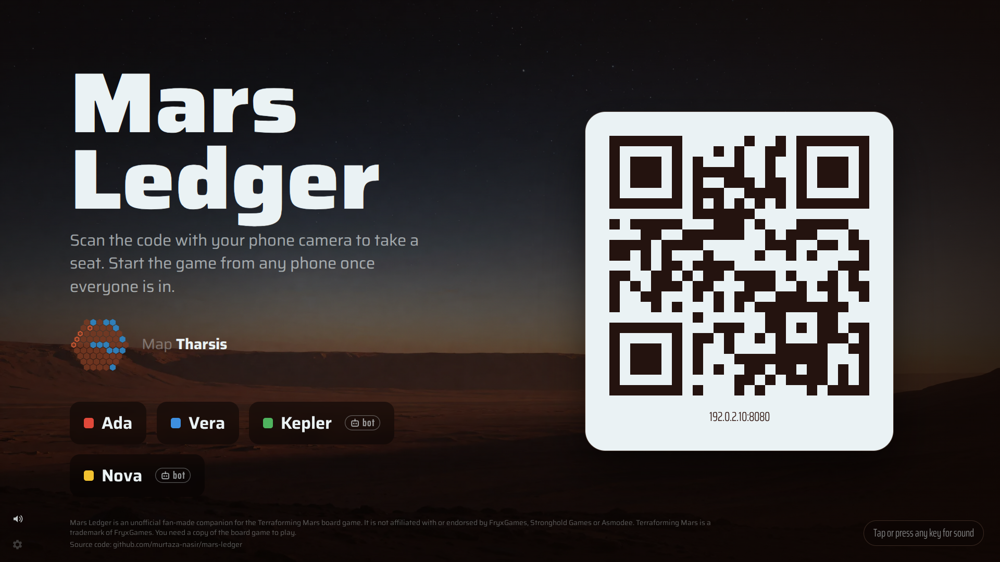

# Getting started

You need a computer or small server with Docker, a TV (or any big screen) with a web browser, and one phone
per player. Everything stays on your network.

## Run it

```sh
git clone https://github.com/murtaza-nasir/mars-ledger.git
cd mars-ledger/deploy
cp ../.env.example .env   # optional: every setting has a default
```

Then start it one of two ways.

=== "Published images"

    ```sh
    docker compose up -d
    ```

=== "Build on this machine"

    ```sh
    docker compose -f docker-compose.yml -f docker-compose.build.yml up -d --build
    ```

    Both images are built from source. You need access to github.com. The engine takes several minutes the first
    time.

The app is served on port 8080. To use another port, set `MARS_LEDGER_PORT` in `deploy/.env`.

## Open it

1. On the TV, open `http://<your-server>:8080/tv`. You see the lobby with a QR code.
2. Each player scans the QR code with their phone camera and takes a seat.
3. On any phone, choose **Companion** or **Full game**, pick the map, and start.



If the server's address differs between the phones and the TV, set `PUBLIC_URL` in `deploy/.env`. The QR code
then contains that address.

## Next steps

- [How a game night works](playing-tv.md#how-a-game-night-works)
- [Bots](bots.md) for solo play or a short table
- [Optional AI features](optional-ai.md): photo scanning, mission control
