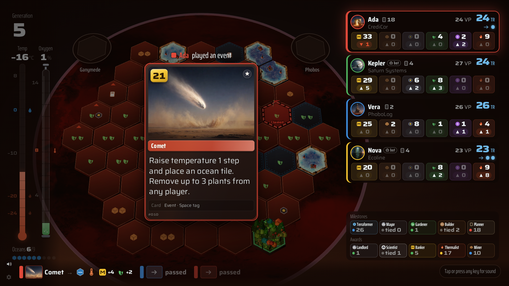

# Playing on the TV

Open `http://<your-server>:8080/tv` in the TV's browser. Any screen works: a smart TV browser, a laptop on HDMI,
a streaming stick with a browser, or a projector.

## The lobby

In the lobby you see the QR code, the chosen map, the players who joined, and the hall of fame: the leaderboard,
recent games and the latest achievements.

## During a game

- **Full game**: the board, in 3D or flat, with every tile. The generation and the global parameters sit on the
  left. The players sit on the right with their points, resources and actions, above the milestones and awards.
  The latest moves run along the bottom.
- **Companion**: the living planet, which changes as the parameters rise, with the player strips and standings.
- Short moments appear when something notable happens: a big card, an attack, a milestone or an award, a new
  generation, the production phase.
- The game ends with a podium, the achievements each player unlocked, the hall of fame and the poster.

Each player panel shows the name and corporation first, then points, resources and action dots. Ready actions
come before used ones, and more than five are shown as a count ("4 of 7"). A player who passed is marked
**passed**. When the column runs short of room (many players, or large text), the panels are folded step by step
and unfolded again when there is room.

## Card moments

When someone plays a card in a full game, the TV shows it in four steps:

1. **Chime.** The player's own chime sounds and their panel pulses.
2. **Travel.** The card flies from their panel to the middle of the board, trailing their colour.
3. **Hold.** The card rests in the middle while the board behind it darkens, so everyone can read it. Cards with
   more text stay longer.
4. **Resolution.** One effect at a time: the board brightens, the gains fly to the player's panel, a ring pings
   the space, and the tile drops onto the board. Then the card goes back.

Nobody waits for the TV. Only the presentation is in sequence, so the next player can already move.
When moves pile up, for example several quick bot moves, every step gets shorter, down to 40% of its usual
length, and gains fly as one token per resource.

Along the bottom, the ticker shows the last three moves: the player's colour, the card, and its effect as icons.
A card is added to the ticker once its moment on the TV is over.

## TV options

Open **TV options** with the gear button in the bottom-left corner. They apply to this screen only:

- sound, volumes and the background hum;
- text size (Normal, Large, Extra large);
- weather and light effects;
- **3D board** on or off, and the tile style (Classic or Detailed);
- camera moves;
- the radio and its volume, when a playlist is configured;
- experimental: board zoom and tilt, and flying over Mars.

The top of the panel also shows the screen's size in page pixels and its pixel density. When the table uses
mission control, a status line under **Mission control voice** shows its state on this screen: for example
"Mission control: last line 2 min ago", "voice waits for a tap or key on this TV", or "Hume is out of credits,
using the backup voice".

### Experimental: zoom, tilt and flying

These options apply to the 3D board only. Each one is off by default; turn it off to restore the usual view.

- With **Adjust board zoom and tilt**, you set the board's size and the camera's tilt with two sliders.
  Choose **Reset to automatic** for the automatic framing.
- With **Fly over Mars**, you fly the camera over the board. Press F, or **Start flying** in the options. Fly with
  WASD or the arrow keys, change height with Q and E, hold Shift for speed, and drag to look. You can also use a
  gamepad or a phone (**Fly the TV camera** in its game menu). With **Bank into turns** on, the camera is tilted
  gently in turns.
- The flight ends when you press Esc, F or the remote's Back key, after a minute without input, when a player must
  choose a space, and when the production phase starts.

With a TV remote, you move between the sound toggle, the gear and the radio with the arrow keys.

## How a game night works

1. Start Mars Ledger on your server. Open `/tv` on the TV.
2. Players scan the QR code and pick their profiles.
3. In the lobby, choose **Full game** or **Companion**, the map, Prelude, the draft and fast mode.
   Optionally, add bots to fill seats (full games only).
4. Start. In a full game, everyone picks a corporation (and preludes) on their phone, and they are revealed on the TV.
5. Play. You make every decision on your phone. The board, the standings and the big moments are on the TV. If the table turned on
   mission control, its lines appear on the TV.
6. At the end, the podium and the poster appear on the TV. Each player sees their own achievements and a copy of the
   poster to save.
7. Tap **Start a new game** in the game menu to take everyone back to the lobby.
